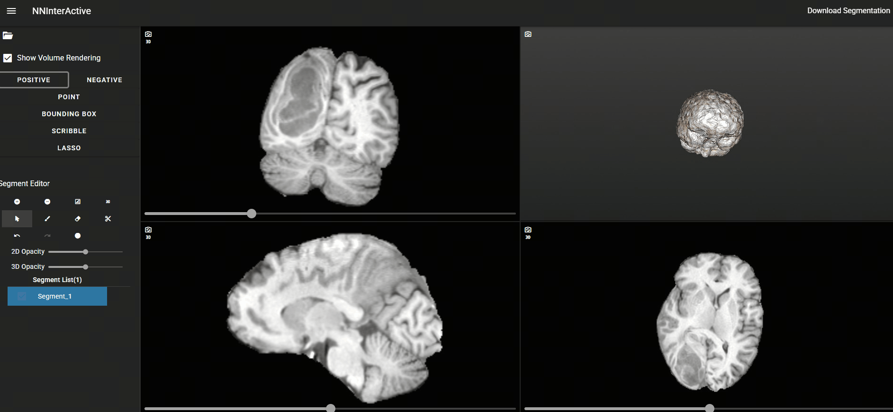

# USAGE
python version: 3.10
```
pip install -r requirements.txt
```
vtk_mrml-9.4.0-cp310-cp310-win_amd64.whl can be found in [trame_slicer](https://github.com/KitwareMedical/trame-slicer/releases?page=2), v0.0.1.  

And run "python medical_viewer_app.py". Then in broser, open http://localhost:8080/ or in other laptop open http://{server ip}:8080/.


# EXAMPLE


# ACKNOWLEDGEMENT 
This repo is adapted from [trame_slicer](https://github.com/KitwareMedical/trame-slicer) and [SlicerNNInteractive](https://github.com/coendevente/SlicerNNInteractive).
